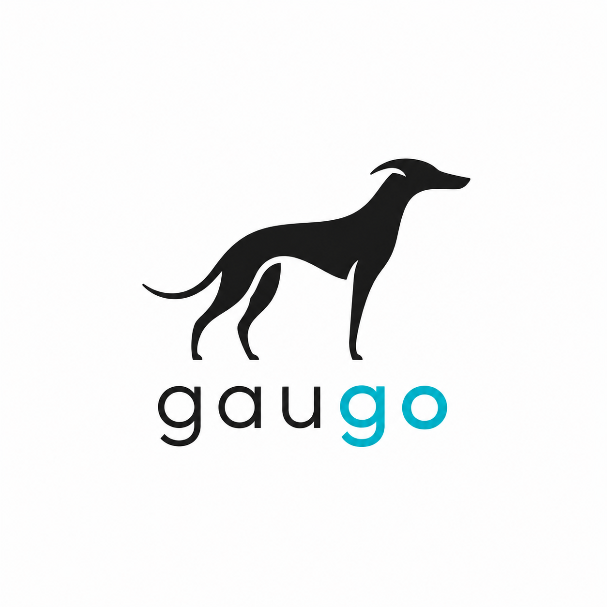

<h1 align="center">
  

  Gaugo
</h1>

<p align="center">
  <a href="https://pkg.go.dev/github.com/nnull13/gaugo">
    
  </a>
</p>

<p align="center">
  <strong>Go-native evaluations for AI applications, runnable through <code>go test</code>.</strong>
</p>

Gaugo lets Go teams evaluate RAG systems, agents, chatbots, and other AI-backed
services with deterministic test cases, optional LLM judges, concurrent
execution, and structured results that fit naturally into CI.

```sh
go get github.com/nnull13/gaugo
```

## Why Gaugo

| Capability | What it gives you |
| --- | --- |
| Native Go tests | Write AI evaluations as normal `testing` tests. |
| Deterministic reporting | Run cases concurrently while preserving registration order. |
| No-LLM checks | Catch required behavior with cheap `ExpectedContains` assertions. |
| LLM-judged metrics | Use structured-output judges for faithfulness and answer relevancy. |
| Programmatic runs | Use `Runner` to feed dashboards, CLIs, and internal pipelines. |
| Provider adapters | Start with OpenAI, Anthropic, Gemini, xAI, or Ollama. |
| Extension points | Bring your own judge, metric, or reporter. |

## Quickstart (No Provider Needed)

This is the smallest end-to-end evaluation you can run with go test.

```go
package rag_test

import (
	"context"
	"testing"

	"github.com/nnull13/gaugo"
)

func TestEnterprisePricing(t *testing.T) {
	suite := gaugo.New(t)

	suite.Case("answer mentions sales",
		gaugo.Question("What is enterprise pricing?"),
		gaugo.ContextDocs(
			gaugo.Document{
				ID:   "pricing.md",
				Text: "Enterprise plans are custom and sold via sales.",
			},
		),
		gaugo.ExpectedContains("sales"),
	)

	suite.Assert(context.Background(), func(ctx context.Context, in gaugo.Input) (gaugo.Output, error) {
		return gaugo.Output{Answer: "Contact sales for enterprise pricing."}, nil
	})
}
```

Run it like any other Go test:

```sh
go test ./...
```

## Add an LLM judge

```go
package rag_test

import (
	"context"
	"os"
	"testing"
	"time"

	"github.com/nnull13/gaugo"
	"github.com/nnull13/gaugo/provider/openai"
)

func TestRAGQuality(t *testing.T) {
	apiKey := os.Getenv("OPENAI_API_KEY")
	if apiKey == "" {
		t.Skip("OPENAI_API_KEY is not set")
	}

	judge, err := openai.New(openai.Config{
		APIKey: apiKey,
		Model:  "gpt-4.1-mini",
	})
	if err != nil {
		t.Fatal(err)
	}

	suite := gaugo.New(t,
		gaugo.WithJudge(judge),
		gaugo.WithParallelism(8),
		gaugo.WithCaseTimeout(15*time.Second),
	)

	suite.Case("pricing answer",
		gaugo.Question("What is enterprise pricing?"),
		gaugo.ContextDocs(gaugo.Document{
			ID:   "pricing.md",
			Text: "Enterprise pricing is custom and handled by sales.",
		}),
		gaugo.ExpectedContains("sales"),
	)

	suite.Assert(context.Background(), yourGaugoEvaluation,
		gaugo.Faithfulness(gaugo.WithThreshold(0.8)),
		gaugo.AnswerRelevancy(gaugo.WithThreshold(0.7)),
	)
}
```

Hosted providers validate URLs in strict mode by default (`https` + official provider hosts). Use `AllowUnsafeURL: true` only for trusted local stubs or custom gateways.

`yourGaugoEvaluation` is your adapter:

```go
func yourGaugoEvaluation(ctx context.Context, in gaugo.Input) (gaugo.Output, error) {
	answer, err := myApp.Answer(ctx, in.Question, in.Context)
	if err != nil {
		return gaugo.Output{}, err
	}
	return gaugo.Output{Answer: answer}, nil
}
```

## Docs & Next Steps

| I want to... | Go to |
| --- | --- |
| Browse all docs from one place | [Documentation index](docs/index.md) |
| Write my first evaluation | [Getting started](docs/getting-started.md) |
| Understand the evaluation model | [Concepts](docs/concepts.md) |
| Use Gaugo inside `go test` | [Testing with Suite](docs/guides/testing-with-suite.md) |
| Run evaluations from a CLI or pipeline | [Programmatic Runner](docs/guides/programmatic-runner.md) |
| Configure metrics and thresholds | [Metrics reference](docs/reference/metrics.md) |
| Choose and configure an LLM provider | [Provider index (OpenAI, Anthropic, Gemini, xAI, Ollama)](docs/provider/index.md) |
| Add a custom judge, metric, or reporter | [Extending Gaugo](docs/extending/custom-judges.md) |
| Debug a failure | [Troubleshooting](docs/troubleshooting.md) |


## License

See [LICENSE](LICENSE).

<h3 align="center">
  <sub>If Gaugo helps your team ship safer AI, consider giving it a star.</sub>
</h3>

<h3 align="center">
  <sub>Crafted by <strong>NoName13</strong>.</sub>
</h3>
