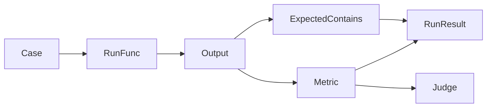

# Concepts

## When to use this

Use this page to understand Gaugo's model before writing larger test suites, CI checks, or custom extensions.

Gaugo evaluates one or more cases by running your system, collecting its answer, and applying deterministic or LLM-backed metrics.



## Case

A `Case` is one evaluation scenario. It has a stable name, an input question, optional context documents, and optional deterministic expectations.

```go
suite.Case("refund policy",
	gaugo.Question("How do refunds work?"),
	gaugo.ContextDocs(
		gaugo.Document{
			ID:   "refunds.md",
			Text: "Refunds are available for 30 days after purchase.",
		},
	),
	gaugo.ExpectedContains("30 days"),
)
```

Case names must be unique within a runner or suite. Empty names and empty questions are rejected.

## Input, Document, and Output

`gaugo.Input` is what Gaugo passes to your system:

```go
type Input struct {
	Question string
	Context  []Document
}
```

`gaugo.Document` represents retrieved or reference context:

```go
type Document struct {
	ID   string
	Text string
}
```

`gaugo.Output` is what your system returns:

```go
type Output struct {
	Answer string
}
```

For RAG systems, pass retrieved documents through `ContextDocs`. For classifiers, copilots, or other AI workflows, use `Question` as the task prompt and put any reference material in `Context`.

## RunFunc

`RunFunc` is the adapter between Gaugo and your application.

```go
type RunFunc func(ctx context.Context, in gaugo.Input) (gaugo.Output, error)
```

Return an error when the system could not run: dependency failure, timeout, invalid request, or another operational failure. Return `gaugo.Output` when the system produced an answer, even if the answer might be wrong.

```go
func yourGaugoEvaluation(ctx context.Context, in gaugo.Input) (gaugo.Output, error) {
	answer := "Contact support for help with your account."
	return gaugo.Output{Answer: answer}, nil
}
```

## Suite

`Suite` is the `go test` entrypoint.

```go
suite := gaugo.New(t,
	gaugo.WithParallelism(8),
	gaugo.WithCaseTimeout(10*time.Second),
)
```

Use `Suite` when failures should fail the current test. `gaugo.New(t)` validates options immediately and calls `t.Fatalf` on invalid configuration.

```go
suite.Case("support contact",
	gaugo.Question("How do I contact support?"),
	gaugo.ExpectedContains("support"),
)

suite.Assert(context.Background(), yourGaugoEvaluation)
```

## Runner

`Runner` is the programmatic entrypoint.

```go
runner, err := gaugo.NewRunner(gaugo.WithParallelism(8))
if err != nil {
	return err
}

if err := runner.Case("support contact",
	gaugo.Question("How do I contact support?"),
	gaugo.ExpectedContains("support"),
); err != nil {
	return err
}

result, err := runner.Run(ctx, yourGaugoEvaluation)
if err != nil {
	return err
}
```

Use `Runner` when you need to store results, build dashboards, generate reports, or run Gaugo outside `go test`.

## ExpectedContains

`ExpectedContains` is a deterministic assertion. It does not call a model.

```go
gaugo.ExpectedContains("contact sales")
```

Use it for required product names, compliance phrases, URLs, support actions, or other exact substrings. It is cheap enough to run on every pull request.

## Metric

A `Metric` evaluates a completed case.

```go
type Metric interface {
	Name() string
	Evaluate(ctx context.Context, in gaugo.EvalInput, j gaugo.Judge) (gaugo.MetricResult, error)
}
```

Built-in metrics include:

- `gaugo.Faithfulness(...)`: scores whether the answer is supported by context documents.
- `gaugo.AnswerRelevancy(...)`: scores whether the answer addresses the question.

Both accept `gaugo.WithThreshold(v)` where `v` must be between `0` and `1`.

```go
suite.Assert(ctx, yourGaugoEvaluation,
	gaugo.Faithfulness(gaugo.WithThreshold(0.8)),
	gaugo.AnswerRelevancy(gaugo.WithThreshold(0.7)),
)
```

## Judge

`Judge` is the interface used by LLM-backed metrics.

```go
type Judge interface {
	EvaluateJSON(ctx context.Context, req gaugo.JudgeRequest) (gaugo.JudgeResponse, error)
}
```

A judge receives metric instructions and a JSON schema. It must return strict JSON in `JudgeResponse.RawJSON`. Gaugo parses that JSON and turns it into metric scores.

Use bundled providers for common model APIs, or implement the interface for internal model gateways and test doubles.

## Reporter

`Reporter` receives completed results without depending on `testing.T`.

```go
type Reporter interface {
	Report(ctx context.Context, result gaugo.RunResult)
}
```

Use reporters for JSON logs, CI annotations, dashboards, or local debugging. When a `Suite` has no custom reporter, Gaugo uses its default testing assertion reporter.

## RunResult

`RunResult` is the stable output of an evaluation run.

```go
type RunResult struct {
	Cases []gaugo.CaseResult
}
```

Each `CaseResult` contains the case name, metric results, run error, and elapsed time. Each `MetricResult` contains the metric name, score, pass/fail state, reason, and optional details.

```go
for _, c := range result.Cases {
	if c.RunError != nil {
		log.Printf("%s failed to run: %v", c.Name, c.RunError)
		continue
	}
	for _, m := range c.Metrics {
		log.Printf("%s %s pass=%t score=%.2f", c.Name, m.Name, m.Pass, m.Score)
	}
}
```

## Validation model

Gaugo fails early for invalid configuration and invalid cases:

- `WithParallelism(0)` is invalid.
- Negative `WithCaseTimeout` is invalid.
- Negative `WithMetricDetailsLimit` is invalid.
- Empty case names are invalid.
- Empty questions are invalid.
- Duplicate case names are invalid.
- Running with no metrics and no `ExpectedContains` checks is invalid.

See [Configuration](reference/configuration.md), [Results and Reporting](reference/results-and-reporting.md), and [Errors and Retries](reference/errors-and-retries.md) for deeper reference material.
